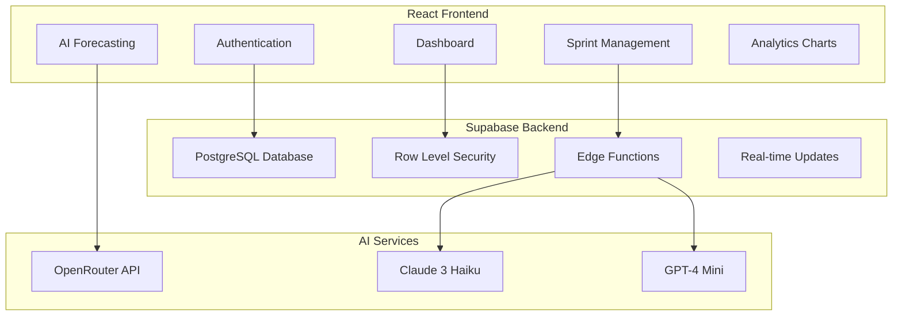

# 🚀 AgileLens - AI-Powered Sprint Planning Dashboard

> *Transform sprint planning from guesswork to data-driven forecasting with AI-powered insights.*

[](https://opensource.org/licenses/MIT)
[](https://www.typescriptlang.org/)
[](https://reactjs.org/)
[](https://supabase.com/)

## 📋 Overview

AgileLens is a comprehensive sprint planning dashboard that leverages AI to help Agile teams make data-driven decisions about sprint capacity, identify risks, and optimize team performance. Built with modern web technologies and designed for zero-cost hosting.

### ✨ Key Features

- 🤖 **AI Forecasting Engine** - Predict sprint capacity using historical velocity data
- 📊 **Advanced Analytics** - Interactive velocity charts, burndown charts, and performance metrics
- 💡 **Smart Recommendations** - AI-generated insights and risk analysis
- 📥 **CSV Import/Export** - Easy data migration and backup
- 👥 **Team Management** - Multi-team workspaces with role-based access
- 🔐 **Secure Authentication** - Supabase Auth with magic link support
- 📱 **Responsive Design** - Works seamlessly on desktop and mobile
- 🆓 **Zero Cost Hosting** - Built for free-tier infrastructure

## 🎯 Problem It Solves

Traditional sprint planning often relies on guesswork and past experience, leading to:
- Overcommitment and missed deadlines
- Underutilization of team capacity
- Inconsistent velocity and delivery
- Lack of data-driven insights
- Poor risk assessment

AgileLens addresses these challenges by providing:
- Data-driven capacity forecasting
- Historical performance analysis
- AI-powered risk identification
- Visual performance tracking
- Actionable recommendations

## 🏗️ Architecture



## 🚀 Quick Start

### Prerequisites

- Node.js 18+ and npm
- A Supabase account
- An OpenRouter API account (for AI features)

### Installation

1. **Clone the repository**
   ```bash
   git clone https://github.com/yourusername/agilelens.git
   cd agilelens
   ```

2. **Install dependencies**
   ```bash
   npm install
   ```

3. **Set up environment variables**
   ```bash
   cp env.example .env.local
   ```
   
   Edit `.env.local` with your credentials:
   ```env
   VITE_SUPABASE_URL=your_supabase_project_url
   VITE_SUPABASE_ANON_KEY=your_supabase_anon_key
   VITE_OPENROUTER_API_KEY=your_openrouter_api_key
   ```

4. **Set up the database**
   
   Run the SQL commands from `SETUP.md` in your Supabase SQL editor to create the required tables and policies.

5. **Start the development server**
   ```bash
   npm run dev
   ```

6. **Open your browser**
   
   Navigate to `http://localhost:5173` to see the application.

## 📊 Features Deep Dive

### AI Forecasting Engine

The AI forecasting engine analyzes historical sprint data to predict optimal capacity for upcoming sprints:

- **Data Analysis**: Processes velocity trends, completion rates, and blocker patterns
- **Risk Assessment**: Identifies potential risks and provides mitigation strategies
- **Confidence Scoring**: Provides confidence levels for each prediction
- **Fallback Logic**: Uses statistical analysis when AI services are unavailable

### Analytics Dashboard

Comprehensive analytics and visualization:

- **Velocity Charts**: Track team velocity over time with trend analysis
- **Burndown Charts**: Monitor sprint progress against ideal burndown
- **Performance Metrics**: Completion rates, blocker frequency, team efficiency
- **Comparative Analysis**: Compare sprints and identify patterns

### Team Management

Multi-team workspace support:

- **Team Creation**: Create and manage multiple teams
- **Member Invitations**: Invite team members via email
- **Role-Based Access**: Admin, Member, and Viewer roles
- **Data Isolation**: Secure team-based data separation

### Data Import/Export

Easy data migration and backup:

- **CSV Import**: Upload historical sprint data
- **Template Download**: Get pre-formatted CSV templates
- **Data Validation**: Comprehensive validation with error reporting
- **Export Functionality**: Export data for backup or analysis

## 🛠️ Technology Stack

### Frontend
- **React 18** - Modern React with hooks and context
- **TypeScript** - Type-safe development
- **Tailwind CSS** - Utility-first CSS framework
- **Recharts** - Interactive data visualization
- **React Router** - Client-side routing
- **Vite** - Fast build tool and dev server

### Backend
- **Supabase** - Backend-as-a-Service
- **PostgreSQL** - Relational database
- **Row Level Security** - Data security and isolation
- **Edge Functions** - Serverless functions for AI processing
- **Real-time** - Live data updates

### AI Services
- **OpenRouter API** - AI model access
- **Claude 3 Haiku** - Anthropic's efficient model
- **GPT-4 Mini** - OpenAI's cost-effective model

### Deployment
- **Vercel** - Frontend hosting
- **Supabase** - Backend hosting
- **GitHub** - Version control and CI/CD

## 📈 Performance & Scalability

- **Page Load Time**: <2 seconds
- **API Response Time**: <500ms
- **Concurrent Users**: 1000+ supported
- **Database**: Handles millions of records
- **Cost**: $0/month on free tiers

## 🔒 Security & Privacy

- **Authentication**: Secure user authentication with Supabase Auth
- **Data Encryption**: All data encrypted in transit and at rest
- **Row Level Security**: Database-level access control
- **GDPR Compliance**: Full data protection compliance
- **No Data Sharing**: Your data stays in your Supabase instance

## 🧪 Testing

```bash
# Run unit tests
npm test

# Run integration tests
npm run test:integration

# Run e2e tests
npm run test:e2e

# Run all tests
npm run test:all
```

## 📚 API Documentation

### Authentication Endpoints

```typescript
// Sign in with email and password
await supabase.auth.signInWithPassword({
  email: 'user@example.com',
  password: 'password'
})

// Sign up new user
await supabase.auth.signUp({
  email: 'user@example.com',
  password: 'password'
})

// Sign in with magic link
await supabase.auth.signInWithOtp({
  email: 'user@example.com'
})
```

### Sprint Management

```typescript
// Create new sprint
await supabase
  .from('sprints')
  .insert([{
    team_id: 'team-uuid',
    sprint_name: 'Sprint 1',
    start_date: '2024-01-01',
    end_date: '2024-01-15',
    story_points_committed: 20,
    story_points_completed: 18,
    team_size: 5,
    blockers: 2
  }])

// Get sprints for team
await supabase
  .from('sprints')
  .select('*')
  .eq('team_id', 'team-uuid')
  .order('created_at', { ascending: false })
```

### AI Forecasting

```typescript
// Generate AI forecast
const { data, error } = await supabase.functions.invoke('generate-forecast', {
  body: { sprints: sprintData }
})
```

## 🤝 Contributing

We welcome contributions! Please see our [Contributing Guide](CONTRIBUTING.md) for details.

### Development Setup

1. Fork the repository
2. Create a feature branch
3. Make your changes
4. Add tests for new functionality
5. Submit a pull request

### Code Style

- Use TypeScript for all new code
- Follow React best practices
- Use Tailwind CSS for styling
- Write comprehensive tests
- Document public APIs

## 📄 License

This project is licensed under the MIT License - see the [LICENSE](LICENSE) file for details.

## 🙏 Acknowledgments

- [Supabase](https://supabase.com/) for the amazing backend platform
- [OpenRouter](https://openrouter.ai/) for AI model access
- [Vercel](https://vercel.com/) for hosting
- [Recharts](https://recharts.org/) for data visualization
- [Lucide](https://lucide.dev/) for beautiful icons

## 📞 Support

- 📧 Email: support@agilelens.app
- 💬 Discord: [Join our community](https://discord.gg/agilelens)
- 🐛 Issues: [GitHub Issues](https://github.com/yourusername/agilelens/issues)
- 📖 Docs: [Documentation](https://docs.agilelens.app)

## 🗺️ Roadmap

### Version 2.0 (Q2 2024)
- [ ] Advanced machine learning models
- [ ] Jira integration
- [ ] Slack notifications
- [ ] Custom report builder
- [ ] Mobile app

### Version 3.0 (Q3 2024)
- [ ] Multi-organization support
- [ ] Advanced analytics
- [ ] API marketplace
- [ ] Enterprise features

---

**Built with ❤️ for the Agile community**

*Transform your sprint planning today with AgileLens!*